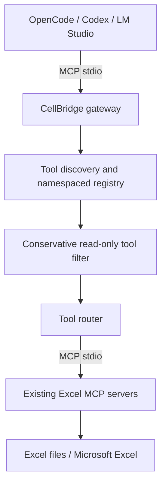

# Architecture · v0.1.0

CellBridge connects existing AI harnesses to existing Excel MCP servers. It does not implement spreadsheet functions, inference, or a new agent harness.

At startup CellBridge validates static JSON configuration, connects to enabled stdio MCP servers, fetches paginated tool lists, applies configured allow/deny lists and the read-only filter, then exposes namespaced tools to the harness. Tool calls are forwarded to the selected upstream via the MCP SDK and their results are returned without spreadsheet-specific transformations. Per-server connection failures are logged; at least one server must connect.

## v0.1 constraints

- Static configuration; restart for changes and tool list refresh.
- Each harness launches a separate gateway and separate upstream sessions.
- Stdio only, no remote HTTP endpoint, no GUI, no auto-update or auto-restart.
- Upstream commands execute with the user's OS privileges: only configure trusted upstream servers.
- No filesystem sandbox or safe-write guarantee. The `readOnly` setting filters exposed tools by metadata/name but is **not** an enforcement boundary. Enforce directory/write controls in the upstream and OS.
- `allowedRoots` is reserved and not enforced in this release.
- stderr is used for diagnostics; stdout is exclusively for MCP protocol data.
